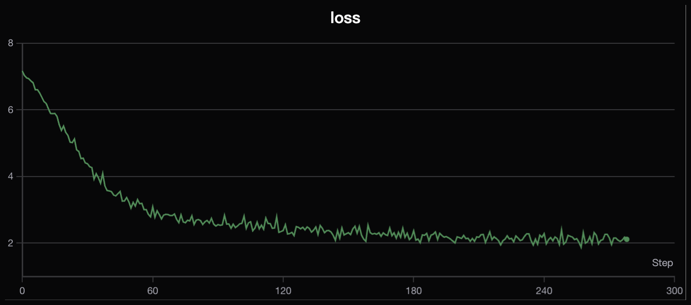
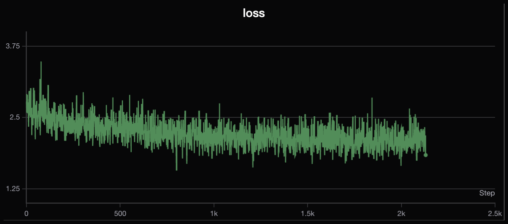

# MiniMind: 从零复现 104M 参数语言模型

<p align="center">
  <a href="https://huggingface.co/swagger00/minimind-demo">
    
  </a>
  <a href="https://github.com/edgetalker/minimind_demo">
    
  </a>
  
  
  
</p>

基于 [MiniMind](https://github.com/jingyaogong/minimind) 开源项目，从零完整复现 104M 参数语言模型的 **预训练 → SFT 指令微调 → MoE 扩展** 全流程，深入理解 Causal LM 训练机制、GQA、RoPE/YaRN 位置编码与 MoE 稀疏激活等核心技术。

---

## ✨ 项目亮点

- **完整训练链路**：Pretrain（4 epoch）→ Full SFT（2 epoch），掌握语言模型从零构建全流程
- **收敛稳定**：Loss 曲线无显著震荡，混合精度 + Cosine LR Warmup 策略有效稳定训练
- **SFT 效果可验**：微调后模型具备基础指令遵循能力，输出质量相比预训练阶段显著提升（见下方对比）
- **MoE 实验**：引入 DeepSeek-V2 风格 MoE 模块（4 路由专家 + 1 共享专家），验证稀疏激活对参数效率的提升
- **工程规范**：完整兼容 HuggingFace `transformers`，模型权重已开源，支持 `from_pretrained` 直接加载

---

## 📁 项目结构

```
minimind_demo/
├── model/
│   ├── config.py          # MiniMindConfig（继承 PretrainedConfig）
│   └── model.py           # 完整模型实现（Attention / MoE / MiniMindForCausalLM）
├── trainer/
│   ├── pretrain.py        # 预训练脚本
│   └── sft.py             # SFT 微调脚本
├── dataset/
│   ├── pretrain_hq.jsonl  # 高质量预训练语料
│   └── sft-512.jsonl      # 指令微调数据集（max_len=512）
├── images/                # 训练 Loss 曲线
└── requirements.txt
```

---

## 🏗️ 模型架构

基于 **Decoder-Only Transformer**，对标 LLaMA 3.1 结构，主要设计如下：

| 模块 | 配置 | 说明 |
|------|------|------|
| 参数量 | **104M** | hidden_size=512，num_layers=8 |
| 注意力 | **GQA**（8 头 Q / 2 头 KV） | n_rep=4，KV Cache 显存降低 75% |
| 位置编码 | **RoPE + YaRN 外推** | 训练长度 2048，推理可外推至 32K |
| FFN 激活 | **SwiGLU** | gate_proj × up_proj → down_proj |
| 归一化 | **RMSNorm**（Pre-Norm） | eps=1e-5，每子层输入前归一化 |
| 注意力加速 | **Flash Attention 2** | seq_len > 1 时自动启用 |
| 词表大小 | 6,400 | 自定义 minimind_tokenizer |

### MoE 模块设计（DeepSeek-V2 风格）

```
FFN → MoEFeedForward
         ├── MoEGate（Softmax 路由，Top-2 激活）
         ├── Routed Experts × 4（稀疏激活，每 token 激活 2 个）
         ├── Shared Expert × 1（所有 token 必经，保底通用能力）
         └── Auxiliary Loss（序列级负载均衡损失，α=0.01）
```

---

## 🏋️ 训练配置

### 预训练（Pretrain）

| 参数 | 值 |
|------|----|
| 训练 Epoch | 4 |
| Batch Size | 32 |
| 数据集 | pretrain_hq.jsonl |
| 训练目标 | Causal LM（Next Token Prediction） |
| 精度 | 混合精度（BF16） |
| 硬件 | 4 × RTX 24G 云端 GPU |

**Loss 曲线：**



> Loss 平稳下降，无显著震荡。YaRN RoPE 配合 Warmup 策略使早期训练稳定收敛。

---

### 指令微调（Full SFT）

| 参数 | 值 |
|------|----|
| 基础模型 | Pretrain checkpoint |
| 训练 Epoch | 2 |
| Batch Size | 16 |
| 数据集 | sft-512.jsonl（max_seq_len=512） |
| Loss Mask | 仅对 assistant 回复部分计算 loss |

**Loss 曲线：**



---

## 🆚 SFT 前后效果对比

相同 prompt，Pretrain 模型（无监督续写）vs SFT 模型（指令遵循）：

| Prompt | Pretrain 输出 | SFT 输出 |
|--------|-------------|---------|
| `介绍一下你自己` | *（无序续写文本）* | `我是MiniMind，一个轻量级语言模型...` |
| `中国的首都是哪里？` | *（续写地理描述）* | `中国的首都是北京。` |
| `用一句话解释机器学习` | *（随机续写）* | `机器学习是让计算机从数据中自动学习规律的方法。` |

> 📝 **TODO**：运行模型后替换为真实输出（参考下方推理代码）。

---

## 🔬 MoE 实验

在 Dense 基础上将 FFN 替换为 MoE 模块：

| 配置 | 路由专家 | 共享专家 | 每 token 激活 | 负载均衡策略 |
|------|---------|---------|-------------|------------|
| Dense | — | — | 全参数 | — |
| MoE | 4 | 1 | Top-2（50%） | Seq-Aux Loss（α=0.01） |

- **参数效率**：路由专家总参数 4×，但推理时每 token 仅激活 Top-2，计算量与 Dense 持平
- **训练稳定性**：序列级辅助损失（`seq_aux=True`）+ Top-K 概率归一化（`norm_topk_prob=True`）有效抑制 Expert Collapse

> 📝 **TODO**：补充 Dense vs MoE 收敛曲线对比图。

---

## 🔑 核心实现细节

### GQA（Grouped Query Attention）

```python
# Q: 8头，KV: 2头，n_rep=4 → KV Cache 显存节省 75%
xk = repeat_kv(xk, n_rep=4)   # [bsz, seq, 2, dim] → [bsz, seq, 8, dim]
xv = repeat_kv(xv, n_rep=4)
```

### YaRN 长度外推

```python
# 训练 max_len=2048，推理外推至 32K（factor=16）
# 线性 ramp 函数区分高低频维度，平滑外推精度损失
rope_scaling = {"type": "yarn", "factor": 16,
                "original_max_position_embeddings": 2048,
                "beta_fast": 32, "beta_slow": 1}
```

### MoE 推理优化

```python
# 推理时 moe_infer：argsort + bincount 批处理，避免逐 token 循环
idxs = flat_expert_indices.argsort()
tokens_per_expert = flat_expert_indices.bincount().cpu().numpy().cumsum(0)
# 每个专家处理一批 token，scatter_add 聚合输出
expert_cache.scatter_add_(0, exp_token_idx.view(-1,1).repeat(1, x.shape[-1]), expert_out)
```

### KV Cache 自回归加速

```python
# 生成时仅计算新 token 的 KV，历史 KV 直接拼接复用
if past_key_value is not None:
    xk = torch.cat([past_key_value[0], xk], dim=1)
    xv = torch.cat([past_key_value[1], xv], dim=1)
```

---

## 🚀 快速开始

### 安装依赖

```bash
git clone https://github.com/edgetalker/minimind_demo.git
cd minimind_demo
pip install -r requirements.txt
```

### 从 HuggingFace 加载推理

```python
import torch
from transformers import AutoModelForCausalLM, AutoTokenizer

model = AutoModelForCausalLM.from_pretrained(
    "swagger00/minimind-demo",
    trust_remote_code=True,
    torch_dtype=torch.bfloat16
).eval()
tokenizer = AutoTokenizer.from_pretrained("swagger00/minimind-demo")

messages = [{"role": "user", "content": "介绍一下你自己"}]
input_ids = tokenizer.apply_chat_template(
    messages, return_tensors="pt", add_generation_prompt=True
)

with torch.no_grad():
    output = model.generate(
        input_ids, max_new_tokens=256,
        temperature=0.7, top_p=0.9, do_sample=True
    )
print(tokenizer.decode(output[0][input_ids.shape[1]:], skip_special_tokens=True))
```

### 从头训练

```bash
# 预训练
python trainer/pretrain.py

# SFT 微调
python trainer/sft.py

# 开启 MoE（config 中设置 use_moe=True）
python trainer/pretrain.py --use_moe
```

---

## 🤗 模型权重

| 模型 | HuggingFace | 说明 |
|------|-------------|------|
| MiniMind-Demo | [swagger00/minimind-demo](https://huggingface.co/swagger00/minimind-demo) | 4 epoch Pretrain + 2 epoch SFT |

---

## 📚 技术参考

| 技术 | 论文 |
|------|------|
| RMSNorm | [Root Mean Square Layer Normalization](https://arxiv.org/abs/1910.07467) |
| RoPE + YaRN | [YaRN: Efficient Context Window Extension](https://arxiv.org/abs/2309.00071) |
| SwiGLU | [GLU Variants Improve Transformer](https://arxiv.org/abs/2002.05202) |
| GQA | [Grouped-Query Attention](https://arxiv.org/abs/2305.13245) |
| Flash Attention 2 | [FlashAttention-2](https://arxiv.org/abs/2307.08691) |
| MoE 路由 | [DeepSeek-V2](https://arxiv.org/abs/2405.04434) |
| AWQ 量化 | [AWQ: Activation-aware Weight Quantization](https://arxiv.org/abs/2306.00978) |
| MiniMind 原项目 | [github.com/jingyaogong/minimind](https://github.com/jingyaogong/minimind) |
| MIT 6.5940 | [EfficientML.ai](https://hanlab.mit.edu/courses/2024-fall-65940) |